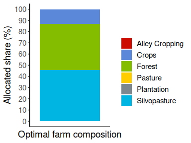

## optimLanduse

<h3>
<a name="menu"></a>
</h3>

<ul>
<li>
<a href="#1. Einleitung">Introduction</a>
</li>
<li>
<a href="#3. Input und Output">Detailed description of the functions' in- and outputs</a>
</li>
<li>
<a href="#5. Beispielhafte Anwendung">Use-case</a>
</li>
<li>
<a href="#6. Erweiterte Anwendung">Sophisticated application</a>
</li>
<li>
<a href="#7. Suggested">Suggested citation</a>
</li>
<li>
<a href="#8. Literatur">Literature</a>
</li>
</ul>

<h3>
<a name="1. Einleitung">Introduction</a>
</h3>

The R package **optimLanduse** provides tools for easy and systematic applications of the robust multiobjective land-cover composition optimization approach of Knoke et al. (2016). It includes tools to determine the land-cover composition that best balances the multiple functions and services a landscape can provide, and tools for understanding and visualizing how these compromises are reasoned. The **README.md** below guides users through the application and highlights possible use-cases on the basis of a published data set. Illustrating the consequences of alternative ecosystem functions on the theoretically optimal landscape composition provides easily interpretable information for landscape modeling and decision making. The method is already established in land-use optimization and has been applied in a couple of studies. More details about the theory, the definition of the formal optimization problem and also significant examples are listed in the <a href="#8. Literatur">literature</a> section

The package opens the approach of Knoke et al. (2016) to the community of landscape and planners and provides opportunities for straightforward systematic or batch applications. To further enhance this, we have designed a graphical shiny application for the package to get a quick idea of the functionalities of the package, see <http://134.76.17.50/optimlanduse_shiny/>.

<h3>
<a name="3. Input und Output">Package structure</a>
</h3>

This chapter provides brief overview over the package functions. For detailed information about methodological background, functions and workflow please refer to Husmann et al. (n.d.) listed in the <a href="#7. Suggested">suggested citation</a> section. Furthermore you can consider the respective help pages for more information. The function *lpSolveAPI* comes from the **lpSolveAPI** package.

<p align="center">
  
</p>

#### Initialization and Input

The *initScenario()* function combines the user settings with the data into an *optimLanduse*-object ready for solving. The following input data are required:

-   *Coefficients table*: The package is **only capable** of processing a long-oriented type of data structure. All combinations of land cover (landUse) alternatives and indicators have to be listed vertically. Each row must contain the average expectation, the uncertainty, and the direction of the respective land-cover and indicator combination. The column names of the table **must follow** the expected nomenclature displayed below. You also find this format in the built-in example tables **exampleGosling.xlsx** or **exampleEmpty.xlsx**. All further columns will be dropped if passed.

<p align="center">
  
</p>

\| See the help files of the **exampleData** and **initScenario** functions for more details. An empty template (incl. predefined headings) \| can be accessed via the exampleData("exampleEmpty.xlsx") function. <br>

-   *uValue*: The argument for the uncertainty level ($f_u$, equation 4 in Husmann et al. (n.d.)). A higher uValue reflects a higher risk aversion of the decision maker. See the help file of the **initScenario** function for more details.

-   *optimisticRule*: Specifies whether the optimistic contributions of each indicator should be defined either directly by their average, or by their average plus their uncertainty (if more is better) or minus its uncertainty (if less is better). The former option is most frequently used in recent literature and therefore builds the default.

-   *fixDistance*: Optional numeric value that defines distinct uncertainty levels for the calculation of the uncertainty space and the averaged distances of a certain land-cover composition (see Equation 9 in Husmann et al. (n. d.)). Passing NA disables fixDistance. The untertainty space is then defined by the uValue.

#### Solver and list with results

The *solveScenario()* function requires the initialized *optimLanduse* object and only a few optional solver-specific arguments. As the solving process has no stochastic element, the calculation times depend almost entirely on the number of digits calculated.

-   *digitsPrecision*: Provides the only possibility for the user to influence the calculation time. As the solving process has no stochastic element, the calculation times depend almost entirely on the number of digits calculated.

-   *lowerBound* & *upperBound*: Optional bounds for the land-use options. The lower bound must be 0 or a vector with lower bounds in the dimension of the land-use options. The upper bound, respectivlely, 1 or a vector with upper bounds in the dimension of the land-use options. Choosing 0 and 1 (the defaults) as boundaries for all decision variables, means that no land-cover alternative is forced into the portfolio and that no land-cover alternative is assigned a maximum.

The resulting *list with results* contains different Information of the optimization model. First the information of the *initScenario()* function are displayed again in this list. These include:

-   *scenarioSettings*: Data frame with *uValue* and *optimisticRule* used.
-   *scenarioTable*: Data frame with one row for each combination of worst-case and best-case outcomes of all indicators (thus the number of scenarios $N_S$ in Husmann et al (n.d.)). The columns contain certain relevant calculation steps of the optimization program. *adjSem\** are the uncertainty adjusted indicators ($R_{liu}$ in Husmann et al. (n.d.)). *minAdjSem* are the minimal uncertainty adjusted indicators $min(R_{liu})$ and $max(R_{liu})$ the maximal uncertainty adjusted indicators. diffAdjSem are the range between these uncertainty adjusted indicators $\delta_{\text{min,max}_{iu}}$.
-   *coefObjective*: The optimization program is translated into a linear program with $N_L$ (number of land-use options) coefficients for the inner solution. The inner solution is solved using *lpSolveAPI*. *coefObjective* is the data frame that contains these coefficients.
-   *coefConstraing*: A data frame with the respective constraints for the inner solution solved by *lpsolveAPI*.
-   *distances*: The distance of each scenario to its own theoretically best-achievable contribution (reference). See equation 3 in Husmann et al. (n.d.).

This is followed by a summary of the results of the optimization:

-   *β*: The maximum distance of the worst performing scenario (equation 1 in Husmann et al. (n.d.)).
-   *landUse*: The resulting land-cover composition in the optimum.

#### Post-processing

-   *calcPerfomance()*: Attaches the portfolio performances of all indicators and scenarios as data frame. The data can be used for straightforward visualization of the performance. The performance is defined as the distance to the maximum achievable level for each indicator and uncertainty scenario.

<h3>
<a name="5. Beispielhafte Anwendung">Use-case</a>
</h3>

We here present the basic workflow on a literature example. Aim of this chapter is to introduce the functionality of the packages' functions and to explain the relevant in- and output on the example of a use-case in Eastern Panama. The data of this study is openly accessible in the *Supplemental material 1* of Gosling et al. (2020) and also firmly integrated into the optimLanduse package. It can be accessed via *exampleData("exampleGosling.xlsx")*. The data integrated in the package comes already in the expected *optimLanduse* format, such that it can be used without any data processing.

Enriching agricultural farms with forest plantations has potential to enhance the ecosystem functioning of farms in Panama. Gosling et al. therefore used the optimization model presented here to understand smallholder farmers' perceptions and values of agroforestry systems. They identified 10 relevant indicators for a predefined set of land use alternatives, which represent the farmers' goals. A subsequent survey of farmers provided the empirical basis in the form of indicators' expectations (arithmetic mean) and uncertainties (standard deviation) for each land-cover alternative. Descriptions of the land-cover alternatives and indicators can be found in tables 1 and 2 in Gosling et al. (2020).

### Installing *optimLanduse*, loading required packages and importing the data


```r
# If not already installed
install.packages("optimLanduse", repos = "https://ftp.gwdg.de/pub/misc/cran/")
```


```r
library(optimLanduse)
library(readxl)
library(ggplot2)
library(tidyverse)
library(ggsci)

# Loading the example data
path <- exampleData("exampleGosling.xlsx")
dat <- read_excel(path)
```

*dat* is in the required format. Refer to the help of the initScenatio function or to the <a href="#3. Input und Output">detailed description of the functions' in- and outputs</a> chapter for more details.


```r
# Initializing an optimLanduse-object
init <- initScenario(dat,
                     uValue = 2,
                     optimisticRule = "expectation", 
                     # optimistic contribution of each indicator directly defined by their average 
                     fixDistance = NA) 
                     # 3 is the default
```

In consistence with Gosling et al., we chose the expectations of the indicator as optimistic outcomes (optimisticRule = "expectation") and the same uncertainty for the calculation of the averaged distances and the uncertainty space (fixDistance = NA, see equations 4 and 9 in Husmann et al. (n.d.) for more details).


```r
# Solve the initialized optimLanduse object using the solveScenario() function                     
result <- solveScenario(x = init)

# Visualize the farm composition
result$landUse %>% gather(key = landUseOption, value = landUseShare, 1 : 6) %>% 
  mutate(uValue = "3",
         landUseShare = landUseShare * 100) %>% 
  ggplot(aes(y = landUseShare, x = uValue, fill = landUseOption)) + 
  geom_bar(position = "stack", stat = "identity") + 
  theme_classic() +
  theme(text = element_text(size = 14)) +
  scale_fill_startrek() +
  labs(x = "Optimal farm composition", y = "Allocated share (%)") +
  scale_y_continuous(breaks = seq(0, 100, 10), 
                     limits = c(0, 100)) +
  theme(axis.text.x = element_blank(),
        axis.ticks.x = element_blank()) + 
  guides(fill=guide_legend(title = ""))
```

<!-- -->

The here optimized farm composition corresponds to figure 3 ($f_u=2$) in Gosling et al (2020).


```r
# Performance calculations
performance <- calcPerformance(result)

performance$scenarioTable$performance <- performance$scenarioTable$performance * 100 

ggplot(performance$scenarioTable,
       aes(x = indicator,
           y = performance,
           color = indicator)) +
  geom_point() +
  geom_hline(yintercept =
               min(performance$scenarioTable$performance),
             linetype = "dashed", color = "red") +
  guides(color = guide_legend(title = "",
                            nrow = 10)) +
  theme_classic() + 
  theme(text = element_text(size = 18),
        legend.position="right") +
  theme(
        axis.ticks.x = element_blank()) +
  scale_x_discrete(labels = seq(1, 10)) +
  labs(y = "Min-max normalized indicator value (%)",
       x = "Indicators") + 
  scale_y_continuous(breaks = seq(0, 101, 10), 
                     limits = c(0, 101)) +
  geom_hline(aes(yintercept=100), size = 1) + 
  annotate(geom = "Text", x = 6, y = 100, label = "Maximum achievable indicator level",
           vjust = -1)
```

<!-- -->

<h4>
Calculations for different uncertainty levels and fixDistance
</h4>


```r
#### uValue == 0 ####

# Initializing an optimLanduse-object using initScenario()
init_u0 <- initScenario(dat,
                     uValue = 0,
                     optimisticRule = "expectation", 
                     # optimistic contribution of each indicator directly defined by their average 
                     fixDistance = 3) 
                     # 3 is the default
init_u0$scenarioSettings
```

```
##   uValue optimisticRule
## 1      0    expectation
```

```r
names(init_u0$scenarioTable)
```

```
##  [1] "indicator"             "outcomeCrops"          "outcomePasture"       
##  [4] "outcomeAlley Cropping" "outcomeSilvopasture"   "outcomePlantation"    
##  [7] "outcomeForest"         "direction"             "meanCrops"            
## [10] "meanPasture"           "meanAlley Cropping"    "meanSilvopasture"     
## [13] "meanPlantation"        "meanForest"            "semCrops"             
## [16] "semPasture"            "semAlley Cropping"     "semSilvopasture"      
## [19] "semPlantation"         "semForest"             "adjSemCrops"          
## [22] "adjSemPasture"         "adjSemAlley Cropping"  "adjSemSilvopasture"   
## [25] "adjSemPlantation"      "adjSemForest"          "minAdjSem"            
## [28] "maxAdjSem"             "diffAdjSem"
```

```r
init_u0$coefObjective
```

```
##          adjSemCrops        adjSemPasture adjSemAlley Cropping 
##             30692.49             39575.50             32183.89 
##   adjSemSilvopasture     adjSemPlantation         adjSemForest 
##             46381.16             32946.34             41772.16
```

```r
colnames(init_u0$coefConstraint)
```

```
## [1] "adjSemCrops_modified"          "adjSemPasture_modified"       
## [3] "adjSemAlley Cropping_modified" "adjSemSilvopasture_modified"  
## [5] "adjSemPlantation_modified"     "adjSemForest_modified"
```

```r
head(init_u0$distance)
```

```
##   minAdjSem maxAdjSem
## 1  5.656250   7.84375
## 2  4.337517   7.84375
## 3  5.423330   7.84375
## 4  4.337517   7.84375
## 5  5.394631   7.84375
## 6  4.337517   7.84375
```

```r
# Solve the initialized optimLanduse object with the solveScenario() function                 
result_u0 <- solveScenario(x = init_u0)

result_u0$status
```

```
## [1] "optimized"
```

```r
result_u0$beta
```

```
## [1] 0.5396
```

```r
result_u0$landUse
```

```
##       Crops Pasture Alley Cropping Silvopasture Plantation    Forest
## 1 0.1292587       0              0    0.4590822          0 0.4116591
```

```r
# Typical result visualization
result_u0$landUse %>% gather(key = landUseOption, value = landUseShare, 1:6) %>% 
  mutate(uValue = "0",
         landUseShare = landUseShare * 100) %>% 
  ggplot(aes(y = landUseShare, x = uValue, fill = landUseOption)) + 
  geom_bar(position = "stack", stat = "identity") + 
  theme_classic() +
  theme(text = element_text(size = 14)) +
  scale_fill_startrek() +
  labs(x = "Optimal farm composition", y = "Allocated share (%)") +
  scale_y_continuous(breaks = seq(0, 100, 10), 
                     limits = c(0, 100)) +
  theme(axis.text.x=element_blank(),
        axis.ticks.x=element_blank()) + 
  guides(fill=guide_legend(title=""))
```

<!-- -->

```r
#### uValue == 3 ####

init_u3 <- initScenario(dat,
                     uValue = 3,
                     optimisticRule = "expectation", 
                     fixDistance = 3) 

                
result_u3 <- solveScenario(x = init_u3)

result_u3$landUse %>% gather(key = landUseOption, value = landUseShare, 1:6) %>% 
  mutate(uValue = "3",
         landUseShare = landUseShare * 100) %>% 
  ggplot(aes(y = landUseShare, x = uValue, fill = landUseOption)) + 
  geom_bar(position = "stack", stat = "identity") + 
  theme_classic() +
  theme(text = element_text(size = 14)) +
  scale_fill_startrek() +
  labs(x = "Optimal farm composition", y = "Allocated share (%)") +
  scale_y_continuous(breaks = seq(0, 100, 10), 
                     limits = c(0, 100)) +
  theme(axis.text.x=element_blank(),
        axis.ticks.x=element_blank()) + 
  guides(fill=guide_legend(title=""))
```

<!-- -->

<h3>
<a name="6. Erweiterte Anwendung">Sophisticated application</a>
</h3>

<h5>
Exemplary batch application for distinct uncertainty values u
</h5>


```r
# define sequence of uncertainties
u <- seq(0, 3, .5)

# prepare empty data frame for the results

## alternative 1: loop, simply implemented ##

loopDf <- data.frame(u = u, matrix(NA, nrow = length(u), ncol = 1 + length(unique(dat$landUse))))
names(loopDf) <- c("u", "beta", unique(dat$landUse))

for(i in u) {
  init <- initScenario(dat, uValue = i, optimisticRule = "expectation", fixDistance = 3)
  result <- solveScenario(x = init)
  loopDf[loopDf$u == i,] <- c(i, result$beta, as.matrix(result$landUse))
}

loopDf[, 3:8] <- loopDf[,3:8] * 100

loopDf %>% gather(key = "land-use option", value = "land-use share", -u, -beta) %>%
  ggplot(aes(y = `land-use share`, x = u, fill = `land-use option`)) + 
  geom_area(alpha = .8, color = "white") + theme_minimal()+
  labs(x = "Uncertainty level", y = "Allocated share (%)") + 
  guides(fill=guide_legend(title="")) + 
  scale_y_continuous(breaks = seq(0, 100, 10), 
                     limits = c(0, 100.01)) +
  scale_x_continuous(breaks = seq(0, 3, 0.5),
                     limits = c(0, 3)) + 
  scale_fill_startrek() +
  theme_classic()+
  theme(text = element_text(size = 18),
        legend.position = "bottom")
```

<!-- -->

```r
# alternative 2: apply, faster
applyDf <- data.frame(u = u)

applyFun <- function(x) {
  init <- initScenario(dat, uValue = x, optimisticRule = "expectation", fixDistance = 3)
  result <- solveScenario(x = init)
  return(c(result$beta, as.matrix(result$landUse)))
}

applyDf <- cbind(applyDf,
                 t(apply(applyDf, 1, applyFun)))
                 
names(applyDf) <- c("u", "beta", names(result$landUse))

applyDf[, 3:8] <- applyDf[,3:8] * 100

applyDf %>% gather(key = "land-use option", value = "land-use share", -u, -beta) %>%
  ggplot(aes(y = `land-use share`, x = u, fill = `land-use option`)) + 
  geom_area(alpha = .8, color = "white") + theme_minimal()+
  labs(x = "Uncertainty level", y = "Allocated share (%)") + 
  guides(fill=guide_legend(title="")) + 
  scale_y_continuous(breaks = seq(0, 100, 10), 
                     limits = c(0, 100.01)) +
  scale_x_continuous(breaks = seq(0, 3, 0.5),
                     limits = c(0, 3)) + 
  scale_fill_startrek() +
  theme_classic()+
  theme(text = element_text(size = 18),
        legend.position = "bottom")
```

<!-- -->

Earlier more pasture because of larger uncertainty frame (TBD)

<h4>
Sophisticated application
</h4>

Test

<h5>
Different indicator bundles 
</h5>


```r
#### Socio-economic bundle ####

dat_socioeconomic <- dat[dat$indicator != "Protecting soil resources" & dat$indicator !="Protecting water supply",]

init_socioeconomic <- initScenario(dat_socioeconomic,
                     uValue = 2,
                     optimisticRule = "expectation", 
                     fixDistance = NA) 

result_socioeconomic <- solveScenario(x = init_socioeconomic)

result_socioeconomic$landUse %>% gather(key = landUseOption, value = landUseShare, 1:6) %>% 
  mutate(uValue = "3",
         landUseShare = landUseShare * 100) %>% 
  ggplot(aes(y = landUseShare, x = uValue, fill = landUseOption)) + 
  geom_bar(position = "stack", stat = "identity") + 
  theme_classic() +
  theme(text = element_text(size = 14)) +
  scale_fill_startrek() +
  labs(x = "Optimal farm composition", y = "Allocated share (%)") +
  scale_y_continuous(breaks = seq(0, 100, 10), 
                     limits = c(0, 100)) +
  theme(axis.text.x=element_blank(),
        axis.ticks.x=element_blank()) + 
  guides(fill=guide_legend(title=""))
```

<!-- -->

```r
#### Farmer priority bundle ####

dat_farmer <- dat[dat$indicator %in% c("Protecting soil resources" , "Protecting water supply", "Meeting household needs"),]

init_farmer<- initScenario(dat_farmer,
                     uValue = 2,
                     optimisticRule = "expectation", 
                     fixDistance = NA) 

result_farmer <- solveScenario(x = init_farmer)

result_farmer$landUse %>% gather(key = landUseOption, value = landUseShare, 1:6) %>% 
  mutate(uValue = "3",
         landUseShare = landUseShare * 100) %>% 
  ggplot(aes(y = landUseShare, x = uValue, fill = landUseOption)) + 
  geom_bar(position = "stack", stat = "identity") + 
  theme_classic() +
  theme(text = element_text(size = 14)) +
  scale_fill_startrek() +
  labs(x = "Optimal farm composition", y = "Allocated share (%)") +
  scale_y_continuous(breaks = seq(0, 100, 10), 
                     limits = c(0, 100)) +
  theme(axis.text.x=element_blank(),
        axis.ticks.x=element_blank()) + 
  guides(fill=guide_legend(title=""))
```

<!-- -->

<h5>
Possibility to analyze the model sensitivity
</h5>


```r
#### Not meeting household needs anymore ####

dat_farmer <- dat[dat$indicator %in% c("Protecting soil resources" , "Protecting water supply"),]
  

init_farmer<- initScenario(dat_farmer,
                     uValue = 2,
                     optimisticRule = "expectation", 
                     fixDistance = NA) 

result_farmer <- solveScenario(x = init_farmer)

result_farmer$landUse %>% gather(key = landUseOption, value = landUseShare, 1:6) %>% 
  mutate(uValue = "3",
         landUseShare = landUseShare * 100) %>% 
  ggplot(aes(y = landUseShare, x = uValue, fill = landUseOption)) + 
  geom_bar(position = "stack", stat = "identity") + 
  theme_classic() +
  theme(text = element_text(size = 14)) +
  scale_fill_startrek() +
  labs(x = "Optimal farm composition", y = "Allocated share (%)") +
  scale_y_continuous(breaks = seq(0, 100, 10), 
                     limits = c(0, 100)) +
  theme(axis.text.x=element_blank(),
        axis.ticks.x=element_blank()) + 
  guides(fill=guide_legend(title=""))
```

<!-- -->

```r
#### Only meeting household needs ####

dat_farmer <- dat[dat$indicator %in% c("Meeting household needs"),]
  
init_farmer<- initScenario(dat_farmer,
                     uValue = 2,
                     optimisticRule = "expectation", 
                     fixDistance = NA) 

result_farmer <- solveScenario(x = init_farmer)

# VVG: Diese Abb ist die einzige, die e nicht im Paper gibt. Sie ist im Zuge dieser  LOO Analyse entstanden.
result_farmer$landUse %>% gather(key = landUseOption, value = landUseShare, 1:6) %>% 
  mutate(uValue = "3",
         landUseShare = landUseShare * 100) %>% 
  ggplot(aes(y = landUseShare, x = uValue, fill = landUseOption)) + 
  geom_bar(position = "stack", stat = "identity") + 
  theme_classic() +
  theme(text = element_text(size = 14)) +
  scale_fill_startrek() +
  labs(x = "Optimal farm composition", y = "Allocated share (%)") +
  scale_y_continuous(breaks = seq(0, 100, 10), 
                     limits = c(0, 100)) +
  theme(axis.text.x=element_blank(),
        axis.ticks.x=element_blank()) + 
  guides(fill=guide_legend(title=""))
```

<!-- -->

<h3>
<a name="7. Suggested">Suggested citation </a>
</h3>

Husmann, K., von Groß, V., Fuchs J.M., Bödeker, K. (2022): optimLanduse: Robust Land-Use Optimization. R package version 1.0.0. <https://CRAN.R-project.org/package=optimLanduse>.

<h3>
<a name="8. Literatur">Literature</a>
</h3>

Gosling, E., Reith, E., Knoke T., Paul, C. (2020): A goal programming approach to evaluate agroforestry systems in Eastern Panama<em>Journal of Environmental Management</em> **261**. <https://doi.org/10.1016/j.jenvman.2020.110248>

Husmann, K.; von Groß, V.; Bödeker, K.; Fuchs, J.; Paul, C.; Knoke, T. (no date): *optimLanduse*: A Package for Multiobjective Land-cover Composition Optimization under Uncertainty. In: *Methods Ecol Evol.* Under revision.

Knoke, T., Paul, C., Hildebrandt, P. et al. (2016): Compositional diversity of rehabilitated tropical lands supports multiple ecosystem services and buffers uncertainties. <em>Nat Commun</EM> **7**, 11877. <https://doi.org/10.1038/ncomms11877>

Paul, C., Weber, M., Knoke, T. (2017): Agroforestry versus farm mosaic systems – Comparing land-use efficiency, economic returns and risks under climate change effects. <em>Sci. Total Environ.</em> **587-588**. <https://doi.org/10.1016/j.scitotenv.2017.02.037>.

Knoke, T., Paul, C., et al. (2020). Accounting for multiple ecosystem services in a simulation of land‐use decisions: Does it reduce tropical deforestation?. <em>Global change biology</em> **26(4)**. <https://doi.org/10.1111/gcb.15003>
