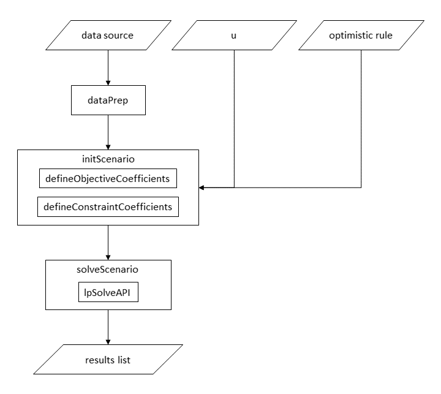

optimLanduse
-----------

<h3>
<a name="menu">Inhaltsverzeichnis</a>
</h3>
<ul>
<li>
<a href="#1. Einleitung">1. Einleitung</a>
</li>
<li>
<a href="#2. Theoretischer Hintergrund">2. Theoretischer Hintergrund</a>
</li>
<li>
<a href="#3. Input und Output">3. Input und Output</a>
</li>
<li>
<a href="#4. Aufbau des Modells">4. Aufbau des Modells</a>
</li>
<li>
<a href="#5. Hinweise zur Anwendung">5. Hinweise zur Anwendung</a>
</li>
<li>
<a href="#6. Beispielhafte Anwendung">6. Beispielhafte Anwendung</a>
</li>
<li>
<a href="#7. Literatur">7. Literatur</a>
</li>
<li>
<a href="#7. Dateien">8. Dateien</a>
</li>
</ul>


<h3>
<a name="1. Einleitung">1. Einleitung</a>
</h3>

**optimLanduse** ist ein R Paket für die multikriterielle robuste Landschaftsoptimierung. Ziel des Pakets ist es, die von der Arbeitsgruppe Knoke entwickelte bzw. für die Landschaftsoptimierung erstmalig vewendete multikriterielle robuste Landschaftsoptimierung komfortabel und skalierbar anwenden zu können. Durch das Einbetten der Optimierung in die R Umgebung werden Datenvor- und -nachbereitung vereinfacht. So werden insbesondere Wiederholungsanwendungen (bspw. Sensitivitätsanalysen oder Distanzanalysen) einfach und schnell möglich.

Das Paket ist so weit wie möglich generisch und modular aufgebaut. So können zukünftige Erweiterungen schnell und einfach hinzugefügt werden. Außerdem können verschiedene Arbeitsgruppen ihre Kenntnisse und Interessen gezielt einbringen, in dem sie sich auf die Entwicklung ihres spezifischen Moduls konzentrieren. Hintergrund ist, dass das Paket eine Basis bilden soll, mit der die Zusammenarbeit zwischen interessierten Arbeitsgruppen der robusten Landschaftsoptimierung vereinfacht werden soll. In diesem Repository liegt der aktuelle Arbeitsstand. Das Paket kann direkt aus dem Repository installiert werden und ist öffentlich erreichbar. Entwicklerinnen und Entwickler können auf Anfrage bei der Abteilung Forstökonomie und nachhaötige Landnutzunhsplanung Zugang zum Repository bekommen. Ihnen stehen dann alle Funktionen des GitLabs zur Verfügung.

Für eine schnelle, einfache Anwendung des Pakets existiert eine grafische Web-Oberfläche (https://gitlab.gwdg.de/forest_economics_goettingen/optimlanduse_shiny).


<h3>
<a name="2. Theoretischer Hintergrund">2. Theoretischer Hintergrund</a>
</h3>

Siehe zum Beispiel (in Arbeit)

- https://pubmed.ncbi.nlm.nih.gov/27292766/
- https://pubmed.ncbi.nlm.nih.gov/28189309/
- https://onlinelibrary.wiley.com/doi/full/10.1111/gcb.15003
- https://link.springer.com/article/10.1007/s10457-020-00519-0

<h3>
<a name="3. Input und Output">3. Input und Output</a>
</h3>

#### Input (mehr Details siehe Pakethilfe)
- Parameterdatei mit Erwartungen und Unsicherheiten. Formatiert wie in der Bespieldatei **dataset.xlsx**
- Unsicherheit **u**
- Form des optimistischen Szenarios, Erwartung oder Erwartung + Unsicherheit?

#### Output (mehr Details siehe Pakethilfe)
- Landnutzungsanteile
- Szenarientabelle
- Mindestabstand **&beta;**

<h3>
<a name="4. Aufbau des Modells">4. Aufbau des Modells</a>
</h3>

In dem Paket wird ein robustes multikriterielles Optimierungsproblem so umformuliert, dass es schritweise mit dem lpSolveAPI Paket gelöst werden kann. Das lpSolveAPI Paket ist in C++ geschrieben. Es gilt als eins der schnellsten Pakete der lineare Optimierung.

<p align="center">
  
</p>
<h3>
<a name="5. Hinweise zur Anwendung">5. Hinweise zur Anwendung</a>
</h3>
Um die aktuellste stabile Version zu installieren, führen Sie den folgenden Code aus.

``` r

## Benötigte Pakete
# Gestestet mit R Version 4.0.3. Bei älteren Versionen müssen die Pakete womöglich einzeln nacheinander installiert werden.
packages <- c("devtools", "lpSolveAPI",
             "dplyr", "tidyr", "remotes",
             "readxl")

## Herunterladen und installieren oder aktivieren

package.check <- lapply(
  packages,
  FUN = function(x) {
    if (!require(x, character.only = TRUE)) {
      install.packages(x, dependencies = TRUE)
      library(x, character.only = TRUE)
    }
  }
)

install_gitlab("forest_economics_goettingen/optimlanduse", host = "gitlab.gwdg.de")

```

<h3>
<a name="6. Beispielhafte Anwendung">6. Beispielhafte Anwendung</a>
</h3>

Einfache Anwendung
``` r
# Pakete laden
library(optimLanduse) 
library(readxl)
library(lpSolveAPI)  
library(dplyr)  
library(tidyr) 

# Daten einlesen
dat <- read_xlsx("database (shrinked).xlsx", col_names = FALSE)
dat <- dataPreparation(dat = dat, uncertainty = "SE", expVAL = "mean")

# Optimierung initialisieren
init <- initScenario(dat, uValue = 2, optimisticRule = "expectation", fixDistance = NULL)

# Optimierung durchführen
result <- solveScenario(x = init)

# Resultate ansehen
result$landUse # Landnutzungsanteile
result$scenarioTable # Szenariotabelle
result$scenarioSettings # Einstellungen anzeigen
result$status # Erfolgreich optimiert oder abgebrochen?
result$beta # Beta
result$landUse # Landnutzungsanteile
```

Batch Anwendung für mehrere Unsicherheiten u
``` r
# Pakete laden
library(optimLanduse)
library(readxl)

# Daten einlesen
dat <- read_xlsx("database (shrinked).xlsx", col_names = FALSE)
dat <- dataPreparation(dat = dat, uncertainty = "SE")

# Sequenz definieren
u <- seq(1, 5, 1)

# Batch vorbereiten
loopDf <- data.frame(u = u, matrix(NA, nrow = length(u), ncol = 1 + length(unique(dat$landUse))))
names(loopDf) <- c("u", "beta", unique(dat$landUse))

# Optimierungen initialisieren und durchführen
# Beispielhaft werden nur die Landnutzungsanteile gespeichert.

# Alternative 1: Schleife, einfach zu programmieren

loopDf <- data.frame(u = u, matrix(NA, nrow = length(u), ncol = 1 + length(unique(dat$landUse))))
names(loopDf) <- c("u", "beta", unique(dat$landUse))

for(i in u) {
  init <- initScenario(dat, uValue = i, optimisticRule = "expectation")
  result <- solveScenario(x = init)
  loopDf[loopDf$u == i,] <- c(i, result$beta, as.matrix(result$landUse))
}

# Alternative 2: apply, schneller
applyDf <- data.frame(u = u)

applyFun <- function(x) {
  init <- initScenario(dat, uValue = x, optimisticRule = "expectation")
  result <- solveScenario(x = init)
  return(c(result$beta, as.matrix(result$landUse)))
}

applyDf <- cbind(applyDf,
                 t(apply(applyDf, 1, applyFun)))
```

Batch Anwendung - parallel

``` r
# Pakete laden
library(optimLanduse) 
library(readxl)
library(doParallel)

# Daten einlesen
dat <- read_xlsx("database (shrinked).xlsx", col_names = FALSE)
dat <- dataPreparation(dat = dat, uncertainty = "SE")

# Kerne initialisieren, bspw. 8 Kerne
registerDoParallel(8)

# Sequenz definieren
u <- seq(1, 5, 1)

# Batch initialisieren und durchführen
loopDf1 <- foreach(i = u, .combine = rbind) %dopar% {
  init <- initScenario(dat, uValue = i, optimisticRule = "expectation")
  result <- solveScenario(x = init)
  c(i, result$beta, as.matrix(result$landUse))
}
# Falls die Kerne wieder freigegeben werden sollen
stopImplicitCluster()
```

Batch Anwendung für mehrere Unsicherheiten und fixierter Distanz auf dem höchsten Unsicherheits-Level u

``` r
# Pakete laden
require(optimLanduse)
require(dplyr)  
require(readxl)
require(lpSolveAPI)  

# Daten einlesen
dat <- read_xlsx("database (shrinked).xlsx", col_names = FALSE)
dat <- dataPreparation(dat = dat, uncertainty = "SE")

# Sequenz definieren
u <- c(5:1) # Wichtig: rueckwaerts!

# Batch vorbereiten
applyDf <- data.frame(u = u)
dist <- NULL
applyFun <- function(x) {
  init <- initScenario(dat, uValue = x, optimisticRule = "expectation",
                       fixDistance = dist)
  result <- optimLanduse::solveScenario(x = init)
  dist <<- result$distance
  return(c(result$beta,
           as.matrix(result$landUse)))
}

# Run & Ergebnis
applyDf <- cbind(applyDf,
                 t(apply(applyDf, 1, applyFun))) %>% 
                 rename_at(vars(factor(1:(length(unique(dat$landUse))+1))),
                           ~ c("beta",unique(dat$landUse))) 
```
