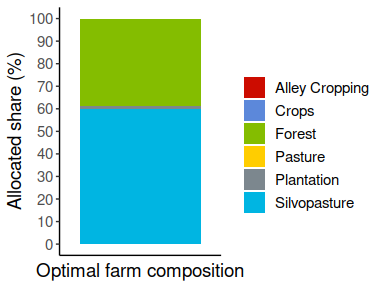

## optimLanduse

<h3>
<a name="menu"></a>
</h3>
<ul>
<li>
<a href="#1. Einleitung">Introduction</a>
</li>
<li>
<a href="#3. Input und Output">Package structure</a>
</li>
<li>
<a href="#6. Beispielhafte Anwendung">Exemplary application</a>
</li>
<li>
<a href="#7. Suggested">Suggested citation</a>
</li>
<li>
<a href="#8. Literatur">Literature</a>
</li>
</ul>
<h3>
<a name="1. Einleitung">Introduction</a>
</h3>

The R package **optimLanduse** provides tools for easy and systematic
applications of the robust multiobjective land-cover composition
optimization approach of Knoke et al. (2016). It includes tools to
determine the land-cover composition that best balances the multiple
functions a landscape can provide, and tools for understanding and
visualizing how these compromises are reasoned. The **README.md** below
guides users through the application and highlights possible use-cases
on the basis of a published data set. Illustrating the consequences of
alternative ecosystem functions on the theoretically optimal landscape
composition provides easily interpretable information for landscape
modeling and decision making. The method is already established in
land-use optimization and has been applied in a couple of studies. More
details about the theory, the definition of the formal optimization
problem and also significant examples are listed in the
<a href="#8. Literatur">literature</a> section

The package opens the approach of Knoke et al. (2016) to the community
of landscape and planners and provides opportunities for straightforward
systematic or batch applications. To further enhance this, we have
designed a graphical shiny application for the package to get a quick
idea of the functionalities of the package, see
<http://134.76.17.50/optimlanduse_shiny/>.

<h3>
<a name="3. Input und Output">Package structure</a>
</h3>

This chapter provides brief overview over the package functions. For
detailed information about methodological background, functions and
workflow please refer to Husmann et al. (under revision) listed in the
<a href="#7. Suggested">suggested citation</a> section. Furthermore you
can consider the respective help pages for more information. The
function *lpSolveAPI* comes from the **lpSolveAPI** package.

<p align="center">

</p>

#### Initialization and Input

The *initScenario()* function integrates the user settings into the data
and returns an *optimLanduse*-object ready for solving. The following
input data are required:

-   *Coefficients table*: The package is **only capable** of processing
    a long-oriented type of data structure. All indicators have to
    vertically listed with their average expectations and uncertainties
    for the different land-cover alternatives. The columns of the table
    **must contain** a predefined heading. You can take this exact
    format from the given example table **exampleGosling.xlsx** or
    follow the below excerpt of this table:

<p align="center">

</p>

           See the help files of the **exampleData** and
**initScenario** functions for more details. An empty template (for
predefined headings)  
           is additionally given in the package and can be called via
exampleData(“exampleEmpty.xlsx”).

<br>

-   *uValue*: The argument for the uncertainty level. A higher uValue
    reflects a higher risk aversion of the decision maker. See the help
    file of the **initScenario** function for more details.

-   *optimisticRule*: Specifies whether the optimistic contributions of
    each indicator should be defined either directly by their average,
    or by their average plus their uncertainty (if more is better) or
    minus its uncertainty (if less is better). The former option is most
    frequently used in recent literature and therefore builds the
    default.

-   *fixDistance*: TBD (Need to create a uniform understandable
    description for readme and helper functions package). Problem is,
    that the definition in the paper is quite linked with the equation
    in the paper.

#### Solver and list with results

The *solveScenario()* function requires the initialized *optimLanduse*
object and only a few optional solver-specific arguments. As the solving
process has no stochastic element, the calculation times depend almost
entirely on the number of digits calculated.

-   *digitsPrecision*: Provides the only possibility for the user to
    influence the calculation time. As the solving process has no
    stochastic element, the calculation times depend almost entirely on
    the number of digits calculated.

-   *lowerBound* & *upperBound*: Optional bounds for the land-use
    options. Choosing 0 and 1 (the defaults) as boundaries for all
    decision variables, means that no land-cover alternative is forced
    into the farm portfolio and that no land-cover alternative is
    assigned a maximum share.

The resulting *list with results* contains different Information of the
optimization model. First the information of the *initScenario()*
function are displayed again in this list. These include:

-   *scenarioSettings*: List of the used values for *uValue* and
    *optimisticRule*.
-   *scenarioTable*: Detailed table with all possible indicator
    combinations.
-   *coefObjective*: The coefficients of the objective function.
-   *coefConstraing*: The constraints of the objective function.
-   *distances*: The distance of each scenario to its own theoretically
    best-achievable contribution.

This is followed by a summary of the results of the optimization:

-   *β*: The maximum distance of the worst performing scenario.
-   *landUse*: The resulting land-cover allocation in the optimum.

#### Post-processing

-   *calcPerfomance()*: Attaches the portfolio performances of all
    scenarios and creates a frame for the visualization. The performance
    is defined as the distance to the maximum achievable level for each
    indicator and uncertainty scenario.

<h3>
<a name="6. Beispielhafte Anwendung">Exemplary application</a>
</h3>
<h4>
Technical workflow with simple example code
</h4>

``` r
install.packages("optimLanduse", repos = "https://ftp.gwdg.de/pub/misc/cran/")
```

``` r
library(optimLanduse)
library(readxl)
library(ggplot2)
library(tidyverse)
library(ggsci)

# Loading the example data file
path <- exampleData("exampleGosling.xlsx")
dat <- read_excel(path)

head(dat)
```

    ## # A tibble: 6 × 6
    ##   indicatorGroup     indicator direction landUse indicatorValue indicatorUncert…
    ##   <chr>              <chr>     <chr>     <chr>            <dbl>            <dbl>
    ## 1 Long-term income   Long-ter… more is … Crops             6.34            0.396
    ## 2 Labour demand      Labour d… less is … Crops             8.31            0.371
    ## 3 Meeting household… Meeting … more is … Crops             9.62            0.223
    ## 4 Financial stabili… Financia… more is … Crops             5.69            0.450
    ## 5 Liquidity          Liquidity more is … Crops             7.45            0.334
    ## 6 Investment costs   Investme… less is … Crops             7.34            0.369

``` r
# Initializing an optimLanduse-object using initScenario()
init <- initScenario(dat,
                     uValue = 2,
                     optimisticRule = "expectation", 
                     # optimistic contribution of each indicator directly defined by their average 
                     fixDistance = NA) 
                     # 3 is the default

# Solve the initialized optimLanduse object with the solveScenario() function                     
result <- solveScenario(x = init)

result$landUse %>% gather(key = landUseOption, value = landUseShare, 1:6) %>% 
  mutate(uValue = "3",
         landUseShare = landUseShare * 100) %>% 
  ggplot(aes(y = landUseShare, x = uValue, fill = landUseOption)) + 
  geom_bar(position = "stack", stat = "identity") + 
  theme_classic() +
  theme(text = element_text(size = 14)) +
  scale_fill_startrek() +
  labs(x = "Optimal farm composition", y = "Allocated share (%)") +
  scale_y_continuous(breaks = seq(0, 100, 10), 
                     limits = c(0, 100)) +
  theme(axis.text.x=element_blank(),
        axis.ticks.x=element_blank()) + 
  guides(fill=guide_legend(title=""))
```

<!-- -->

``` r
# Performance calculations
performance <- calcPerformance(result)

performance$scenarioTable$performance <- performance$scenarioTable$performance * 100 

ggplot(performance$scenarioTable,
       aes(x = indicator,
           y = performance,
           color = indicator)) +
  geom_point() +
  geom_hline(yintercept =
               min(performance$scenarioTable$performance),
             linetype = "dashed", color = "red") +
  guides(color=guide_legend(title="",
                            nrow = 10)) +
  theme_classic() + 
  theme(text = element_text(size = 18),
        legend.position="right") +
  theme(
        axis.ticks.x=element_blank())+
  scale_x_discrete(labels = seq(1, 10)) +
  labs(y = "Min-max normalized indicator value (%)",
       x = "Indicators") + 
  scale_y_continuous(breaks = seq(0, 101, 10), 
                     limits = c(0, 101))+
  geom_hline(aes(yintercept=100), size =1) + 
  annotate(geom = "Text", x = 6, y = 100, label = "Maximum achievable indicator level",
           vjust = -1)
```

<!-- -->

<h4>
Calculations for different uncertainty levels and fixDistance
</h4>

``` r
#### uValue == 0 ####

# Initializing an optimLanduse-object using initScenario()
init_u0 <- initScenario(dat,
                     uValue = 0,
                     optimisticRule = "expectation", 
                     # optimistic contribution of each indicator directly defined by their average 
                     fixDistance = 3) 
                     # 3 is the default
init_u0$scenarioSettings
```

    ##   uValue optimisticRule
    ## 1      0    expectation

``` r
names(init_u0$scenarioTable)
```

    ##  [1] "indicator"             "outcomeCrops"          "outcomePasture"       
    ##  [4] "outcomeAlley Cropping" "outcomeSilvopasture"   "outcomePlantation"    
    ##  [7] "outcomeForest"         "direction"             "meanCrops"            
    ## [10] "meanPasture"           "meanAlley Cropping"    "meanSilvopasture"     
    ## [13] "meanPlantation"        "meanForest"            "semCrops"             
    ## [16] "semPasture"            "semAlley Cropping"     "semSilvopasture"      
    ## [19] "semPlantation"         "semForest"             "adjSemCrops"          
    ## [22] "adjSemPasture"         "adjSemAlley Cropping"  "adjSemSilvopasture"   
    ## [25] "adjSemPlantation"      "adjSemForest"          "minAdjSem"            
    ## [28] "maxAdjSem"             "diffAdjSem"

``` r
init_u0$coefObjective
```

    ##          adjSemCrops        adjSemPasture adjSemAlley Cropping 
    ##             30692.49             39575.50             32183.89 
    ##   adjSemSilvopasture     adjSemPlantation         adjSemForest 
    ##             46381.16             32946.34             41772.16

``` r
colnames(init_u0$coefConstraint)
```

    ## [1] "adjSemCrops_modified"          "adjSemPasture_modified"       
    ## [3] "adjSemAlley Cropping_modified" "adjSemSilvopasture_modified"  
    ## [5] "adjSemPlantation_modified"     "adjSemForest_modified"

``` r
head(init_u0$distance)
```

    ##   minAdjSem maxAdjSem
    ## 1  5.656250   7.84375
    ## 2  4.337517   7.84375
    ## 3  5.423330   7.84375
    ## 4  4.337517   7.84375
    ## 5  5.394631   7.84375
    ## 6  4.337517   7.84375

``` r
# Solve the initialized optimLanduse object with the solveScenario() function                 
result_u0 <- solveScenario(x = init_u0)

result_u0$status
```

    ## [1] "optimized"

``` r
result_u0$beta
```

    ## [1] 0.5396

``` r
result_u0$landUse
```

    ##       Crops Pasture Alley Cropping Silvopasture Plantation    Forest
    ## 1 0.1292587       0              0    0.4590822          0 0.4116591

``` r
# Typical result visualization
result_u0$landUse %>% gather(key = landUseOption, value = landUseShare, 1:6) %>% 
  mutate(uValue = "0",
         landUseShare = landUseShare * 100) %>% 
  ggplot(aes(y = landUseShare, x = uValue, fill = landUseOption)) + 
  geom_bar(position = "stack", stat = "identity") + 
  theme_classic() +
  theme(text = element_text(size = 14)) +
  scale_fill_startrek() +
  labs(x = "Optimal farm composition", y = "Allocated share (%)") +
  scale_y_continuous(breaks = seq(0, 100, 10), 
                     limits = c(0, 100)) +
  theme(axis.text.x=element_blank(),
        axis.ticks.x=element_blank()) + 
  guides(fill=guide_legend(title=""))
```

<!-- -->

``` r
#### uValue == 3 ####

init_u3 <- initScenario(dat,
                     uValue = 3,
                     optimisticRule = "expectation", 
                     fixDistance = 3) 

                
result_u3 <- solveScenario(x = init_u3)

result_u3$landUse %>% gather(key = landUseOption, value = landUseShare, 1:6) %>% 
  mutate(uValue = "3",
         landUseShare = landUseShare * 100) %>% 
  ggplot(aes(y = landUseShare, x = uValue, fill = landUseOption)) + 
  geom_bar(position = "stack", stat = "identity") + 
  theme_classic() +
  theme(text = element_text(size = 14)) +
  scale_fill_startrek() +
  labs(x = "Optimal farm composition", y = "Allocated share (%)") +
  scale_y_continuous(breaks = seq(0, 100, 10), 
                     limits = c(0, 100)) +
  theme(axis.text.x=element_blank(),
        axis.ticks.x=element_blank()) + 
  guides(fill=guide_legend(title=""))
```

<!-- -->

<h5>
Exemplary batch application for distinct uncertainty values u
</h5>

``` r
# define sequence of uncertainties
u <- seq(0, 3, .5)

# prepare empty data frame for the results

## alternative 1: loop, simply implemented ##

loopDf <- data.frame(u = u, matrix(NA, nrow = length(u), ncol = 1 + length(unique(dat$landUse))))
names(loopDf) <- c("u", "beta", unique(dat$landUse))

for(i in u) {
  init <- initScenario(dat, uValue = i, optimisticRule = "expectation", fixDistance = 3)
  result <- solveScenario(x = init)
  loopDf[loopDf$u == i,] <- c(i, result$beta, as.matrix(result$landUse))
}

loopDf[, 3:8] <- loopDf[,3:8] * 100

loopDf %>% gather(key = "land-use option", value = "land-use share", -u, -beta) %>%
  ggplot(aes(y = `land-use share`, x = u, fill = `land-use option`)) + 
  geom_area(alpha = .8, color = "white") + theme_minimal()+
  labs(x = "Uncertainty level", y = "Allocated share (%)") + 
  guides(fill=guide_legend(title="")) + 
  scale_y_continuous(breaks = seq(0, 100, 10), 
                     limits = c(0, 100.01)) +
  scale_x_continuous(breaks = seq(0, 3, 0.5),
                     limits = c(0, 3)) + 
  scale_fill_startrek() +
  theme_classic()+
  theme(text = element_text(size = 18),
        legend.position = "bottom")
```

<!-- -->

``` r
# alternative 2: apply, faster
applyDf <- data.frame(u = u)

applyFun <- function(x) {
  init <- initScenario(dat, uValue = x, optimisticRule = "expectation", fixDistance = 3)
  result <- solveScenario(x = init)
  return(c(result$beta, as.matrix(result$landUse)))
}

applyDf <- cbind(applyDf,
                 t(apply(applyDf, 1, applyFun)))
                 
names(applyDf) <- c("u", "beta", names(result$landUse))

applyDf[, 3:8] <- applyDf[,3:8] * 100

applyDf %>% gather(key = "land-use option", value = "land-use share", -u, -beta) %>%
  ggplot(aes(y = `land-use share`, x = u, fill = `land-use option`)) + 
  geom_area(alpha = .8, color = "white") + theme_minimal()+
  labs(x = "Uncertainty level", y = "Allocated share (%)") + 
  guides(fill=guide_legend(title="")) + 
  scale_y_continuous(breaks = seq(0, 100, 10), 
                     limits = c(0, 100.01)) +
  scale_x_continuous(breaks = seq(0, 3, 0.5),
                     limits = c(0, 3)) + 
  scale_fill_startrek() +
  theme_classic()+
  theme(text = element_text(size = 18),
        legend.position = "bottom")
```

<!-- -->

Earlier more pasture because of larger uncertainty frame (TBD)

<h4>
Sophisticated application
</h4>

Test

<h5>
Different indicator bundles
</h5>

``` r
#### Socio-economic bundle ####

dat_socioeconomic <- dat[dat$indicator != "Protecting soil resources" & dat$indicator !="Protecting water supply",]

init_socioeconomic <- initScenario(dat_socioeconomic,
                     uValue = 2,
                     optimisticRule = "expectation", 
                     fixDistance = NA) 

result_socioeconomic <- solveScenario(x = init_socioeconomic)

result_socioeconomic$landUse %>% gather(key = landUseOption, value = landUseShare, 1:6) %>% 
  mutate(uValue = "3",
         landUseShare = landUseShare * 100) %>% 
  ggplot(aes(y = landUseShare, x = uValue, fill = landUseOption)) + 
  geom_bar(position = "stack", stat = "identity") + 
  theme_classic() +
  theme(text = element_text(size = 14)) +
  scale_fill_startrek() +
  labs(x = "Optimal farm composition", y = "Allocated share (%)") +
  scale_y_continuous(breaks = seq(0, 100, 10), 
                     limits = c(0, 100)) +
  theme(axis.text.x=element_blank(),
        axis.ticks.x=element_blank()) + 
  guides(fill=guide_legend(title=""))
```

<!-- -->

``` r
#### Farmer priority bundle ####

dat_farmer <- dat[dat$indicator %in% c("Protecting soil resources" , "Protecting water supply", "Meeting household needs"),]

init_farmer<- initScenario(dat_farmer,
                     uValue = 2,
                     optimisticRule = "expectation", 
                     fixDistance = NA) 

result_farmer <- solveScenario(x = init_farmer)

result_farmer$landUse %>% gather(key = landUseOption, value = landUseShare, 1:6) %>% 
  mutate(uValue = "3",
         landUseShare = landUseShare * 100) %>% 
  ggplot(aes(y = landUseShare, x = uValue, fill = landUseOption)) + 
  geom_bar(position = "stack", stat = "identity") + 
  theme_classic() +
  theme(text = element_text(size = 14)) +
  scale_fill_startrek() +
  labs(x = "Optimal farm composition", y = "Allocated share (%)") +
  scale_y_continuous(breaks = seq(0, 100, 10), 
                     limits = c(0, 100)) +
  theme(axis.text.x=element_blank(),
        axis.ticks.x=element_blank()) + 
  guides(fill=guide_legend(title=""))
```

<!-- -->

<h5>
Possibility to analyze the model sensitivity
</h5>

``` r
#### Not meeting household needs anymore ####

dat_farmer <- dat[dat$indicator %in% c("Protecting soil resources" , "Protecting water supply"),]
  

init_farmer<- initScenario(dat_farmer,
                     uValue = 2,
                     optimisticRule = "expectation", 
                     fixDistance = NA) 

result_farmer <- solveScenario(x = init_farmer)

result_farmer$landUse %>% gather(key = landUseOption, value = landUseShare, 1:6) %>% 
  mutate(uValue = "3",
         landUseShare = landUseShare * 100) %>% 
  ggplot(aes(y = landUseShare, x = uValue, fill = landUseOption)) + 
  geom_bar(position = "stack", stat = "identity") + 
  theme_classic() +
  theme(text = element_text(size = 14)) +
  scale_fill_startrek() +
  labs(x = "Optimal farm composition", y = "Allocated share (%)") +
  scale_y_continuous(breaks = seq(0, 100, 10), 
                     limits = c(0, 100)) +
  theme(axis.text.x=element_blank(),
        axis.ticks.x=element_blank()) + 
  guides(fill=guide_legend(title=""))
```

<!-- -->

``` r
#### Only meeting household needs ####

dat_farmer <- dat[dat$indicator %in% c("Meeting household needs"),]
  
init_farmer<- initScenario(dat_farmer,
                     uValue = 2,
                     optimisticRule = "expectation", 
                     fixDistance = NA) 

result_farmer <- solveScenario(x = init_farmer)

result_farmer$landUse %>% gather(key = landUseOption, value = landUseShare, 1:6) %>% 
  mutate(uValue = "3",
         landUseShare = landUseShare * 100) %>% 
  ggplot(aes(y = landUseShare, x = uValue, fill = landUseOption)) + 
  geom_bar(position = "stack", stat = "identity") + 
  theme_classic() +
  theme(text = element_text(size = 14)) +
  scale_fill_startrek() +
  labs(x = "Optimal farm composition", y = "Allocated share (%)") +
  scale_y_continuous(breaks = seq(0, 100, 10), 
                     limits = c(0, 100)) +
  theme(axis.text.x=element_blank(),
        axis.ticks.x=element_blank()) + 
  guides(fill=guide_legend(title=""))
```

<!-- -->

<h3>
<a name="7. Suggested">Suggested citation </a>
</h3>

Husmann, K.; von Groß, V.; Bödeker, K.; Fuchs, J.; Paul, C.; Knoke, T.
(under revision): *optimLanduse*: A Package for Multiobjective
Land-cover Composition Optimization under Uncertainty. In: *Methods Ecol
Evol.*

<h3>
<a name="8. Literatur">Literature</a>
</h3>

Gosling, E., Reith, E., Knoke T., Gerique, A., Paul, C. (2020):
Exploring farmer perceptions of agroforestry via multi-objective
optimisation: a test application in Eastern Panama. <em>Agroforestry
Systems</em> **94(5)**. <https://doi.org/10.1007/s10457-020-00519-0>

Knoke, T., Paul, C., Hildebrandt, P. et al. (2016): Compositional
diversity of rehabilitated tropical lands supports multiple ecosystem
services and buffers uncertainties. <em>Nat Commun</EM> **7**, 11877.
<https://doi.org/10.1038/ncomms11877>

Paul, C., Weber, M., Knoke, T. (2017): Agroforestry versus farm mosaic
systems – Comparing land-use efficiency, economic returns and risks
under climate change effects. <em>Sci. Total Environ.</em> **587-588**.
<https://doi.org/10.1016/j.scitotenv.2017.02.037>.

Knoke, T., Paul, C., et al. (2020). Accounting for multiple ecosystem
services in a simulation of land‐use decisions: Does it reduce tropical
deforestation?. <em>Global change biology</em> **26(4)**.
<https://doi.org/10.1111/gcb.15003>
