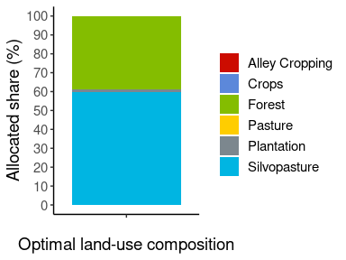
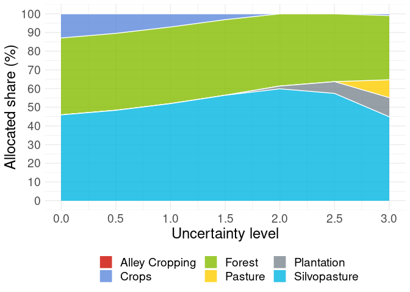
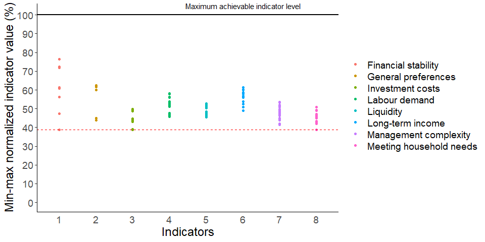

## optimLanduse

[](https://cran.r-project.org/package=optimLanduse)
[](https://cran.r-project.org/package=optimLanduse)
[](https://cran.r-project.org/package=optimLanduse)
[](https://github.com/Forest-Economics-Goettingen/optimLanduse/commits/master)
[](https://github.com/Forest-Economics-Goettingen/optimLanduse)

<h3>
<a name="menu"></a>
</h3>
<ul>
<li>
<a href="#1. Einleitung">1. Introduction</a>
</li>
<li>
<a href="#3. Input und Output">2. Detailed Description of the Functions’
In- and Outputs</a>
</li>
<li>
<a href="#5. Beispielhafte Anwendung">3. Example Application</a>
</li>
<li>
<a href="#6. Erweiterte Anwendung">4. Batch application and sensitivity
analysis</a>
</li>
<li>
<a href="#7. Suggested">5. Suggested Citation</a>
</li>
<li>
<a href="#8. Literatur">6. Literature</a>
</li>
</ul>
<h3>
<a name="1. Einleitung">1. Introduction</a>
</h3>

When managing ecosystems, the question arises as to how to
simultaneously combat biodiversity loss and maintain ecosystem
functioning while improving human welfare. Designing multifunctional
landscapes means deciding upon the composition and configuration of
land-cover types, given that landscape patterns drive the landscape\`s
ecological value and its ability to satisfy societal demands. Land-cover
allocation models, particularly optimization approaches, have proven
helpful in revealing trade-offs between multiple objectives and services
provided by different land-cover compositions.

The R package **optimLanduse** provides functions for easy and
systematic applications of the robust multiobjective land-cover
composition optimization approach of Knoke et al. (2016). It includes
tools to determine the land-cover composition that best balances the
multiple functions and services a landscape can provide, as well as
tools for a deeper understanding and visualization of the contributions
of the distinct indicators. The method has been developed and applied
previously in a couple of studies, with some examples to be found in the
<a href="#8. Literatur">literature</a> section. The methodological
background of the approach can e.g., be found in Knoke et al. (2016) and
Husmann et al. (n.d.). We here refer to the nomenclature of Husmann et
al. (n.d.). The package opens the approach of Knoke et al. (2016) to the
community of landscape planners and provides opportunities for
systematic or batch applications. To further enhance this, we have
designed a shiny dashboard for the package to get a brief idea of its
functionalities and to faciliate the usage of the package, see
<http://134.76.17.50/optimlanduse_shiny/>. The current package version
optimizes land-cover compositions, but aspects of configuration may be
added in the future.

<h3>
<a name="3. Input und Output">2. Detailed Description of the Functions’
In- and Outputs</a>
</h3>

This chapter provides a brief overview of the package functions (Fig.
1). For detailed information on methodological background, functions,
and workflow please also refer to Husmann et al. (n.d.). We further
refer the reader to the respective help pages of the package for more
information.

The stable version of the package can be installed using the CRAN
server. The development version can be found on the GitHub project page.

``` r
# If not already installed
install.packages("optimLanduse")
```

<p align="center">


</p>

*Fig. 1: Overview of the functions of the* ***optimLanduse*** *package.
Green diamonds: input and output data; blue rectangles: functions; gray
parallelograms: optional function settings.*

#### Initialization and Input

The *initScenario()* function combines the user settings with the data
into an *optimLanduse*-object ready for solving. The following input
data are required:

-   *coefTable*: The package is only capable of processing a
    long-oriented type of data structure (Table 1). All combinations of
    land-cover (landUse) alternatives and indicators must be listed
    vertically. Each row must contain the average expectation, the
    uncertainty, and the direction (more is better/ less is better) of
    the respective land-cover and indicator combination. The column
    names of the table must exactly follow the nomenclature displayed
    below. You can also find this format in the built-in example tables
    **exampleGosling.xlsx** or **exampleEmpty.xlsx**. The help files of
    the *exampleData()* and *initScenario()* functions contain more
    details regarding the required data format. An empty template
    incl. the predefined headings can be accessed via
    *exampleData(“exampleEmpty.xlsx”)*. All further columns in the
    coefTable will be dropped.

*Table 1: Example of the data set from Gosling et al. (2020) to
illustrate the required data structure.*

<p align="center">


</p>

-   *uValue*: The argument for the uncertainty level
    (,
    Equation 4 in Husmann et al. (n.d.)). A higher uValue reflects a
    higher risk aversion of the decision maker. See the help file of the
    *initScenario* function for more details.

-   *optimisticRule*: Specifies whether the optimistic contributions of
    each indicator should be defined either directly by their average,
    or by their average plus their uncertainty (if more is better) or
    minus their uncertainty (if less is better). The former option is
    most frequently used in recent literature and therefore builds the
    default.

-   *fixDistance*: Optional numeric value that defines distinct
    uncertainty levels for the calculation of the uncertainty space and
    the averaged distances of a certain land-cover composition (see
    Equation 9 in Husmann et al. (n. d.)). Passing NA disables
    fixDistance. The uncertainty space is then defined by the uValue.

#### Solver and List with results

The *solveScenario()* function takes the initialized
*optimLanduse*-object and only a few optional solver-specific arguments.

-   *digitsPrecision*: Provides the only possibility for the user to
    influence the calculation time. As the solving process has no
    stochastic element, the calculation times depend almost only on the
    number of digits calculated only.

-   *lowerBound* & *upperBound*: Optional bounds for the land-cover
    alternatives. The lower bound must be 0 or a vector with lower
    bounds in the dimension of the number of land-cover alternatives.
    The upper bound, respectively, must be 1 or a vector with upper
    bounds. Choosing 0 and 1 (the defaults) as boundaries for all
    decision variables, means that no land-cover alternative is forced
    into the portfolio and that no land-cover alternative is assigned a
    maximum.

The returned *list with results* contains different information on the
optimization model. It first repeats the settings of the
*initScenario()*. These include:

-   *scenarioSettings*: A data frame with the *uValue* and the
    *optimisticRule*.
-   *scenarioTable*: A data frame with one row for each combination of
    worst-case and best-case outcomes of all indicators (thus the number
    of rows equals the number of scenarios
    
    in Husmann et al (n.d.)). The columns contain relevant calculation
    steps for the optimization program. *adjSem\** are the uncertainty
    adjusted indicators
    (
    in Husmann et al. (n.d.)). *minAdjSem* are the minimum uncertainty
    adjusted indicators
    ")
    and
    ")
    the maximum uncertainty adjusted indicators. diffAdjSem are the
    range between these uncertainty adjusted indicators
    .
-   *coefObjective*: The optimization program is translated into a
    linear program with
    
    (number of land-cover options) coefficients for the inner solution.
    The inner solution is solved using the *lpSolveAPI()* function of
    the **lpSolveApi** package. *coefObjective* is the data frame that
    contains these coefficients.
-   *coefConstraint*: A data frame with the respective constraints for
    the inner solution solved by *lpsolveAPI()*.
-   *distance*: The distance of each scenario to its own theoretically
    best-achievable contribution (reference). See Equation 3 in Husmann
    et al. (n.d.).

This is followed by a summary of the results of the optimization:

-   :
    The maximum distance of the worst performing scenario (Equation 1 in
    Husmann et al. (n.d.)).
-   *landUse*: The resulting land-cover composition after the
    optimization.

#### Post-Processing

-   *calcPerformance()*: Attaches the portfolio performances of all
    indicators and scenarios as a data frame to the soved optimLanduse
    object. The data can be used for straightforward visualization of
    the performance (e.g. Fig. 3). The performance is defined as the
    distance to the maximum achievable level for each indicator and
    uncertainty scenario.

<h3>
<a name="5. Beispielhafte Anwendung">3. Example Application</a>
</h3>

We here present the basic workflow on a literature example. The aim of
this chapter is to introduce the functionality of the packages’
functions and to explain the relevant in- and output on the example of a
use-case in Eastern Panama. The data of this study can be accessed in
*Appendix A* of Gosling et al. (2020) and is also firmly integrated into
the **optimLanduse** package. It can be accessed via
*exampleData(“exampleGosling.xlsx”)*. The data integrated in the package
already comes in the required *optimLanduse* format, so that it can be
used without any data processing.

Enriching agricultural farms with agroforestry has been promoted as a
means to enhance ecosystem functioning in farms in Panama, while
maintaining important economic functions. Gosling et al. (2020)
therefore used the here presented optimization model to understand
smallholder farmers’ perceptions and values of agroforestry systems.
They identified 10 relevant indicators for a predefined set of
land-cover alternatives, which represent the farmers’ goals (such as
long and short-term income or labor demand, as well as carbon and water
regulation). A survey with local farmers provided the empirical basis in
the form of the farmer’s expectations on the indicator performance of
each land-cover (arithmetic mean) and its uncertainties (using the
standard error of the mean across the survey’s respondents).
Descriptions of the land-cover alternatives and indicators can be found
in Tables 1 and 2 in Gosling et al. (2020).

### Loading Required Packages and Importing the Data

``` r
library(optimLanduse)
library(readxl)
library(ggplot2)
library(tidyverse)
library(ggsci)

# Loading the example data
path <- exampleData("exampleGosling.xlsx")
dat <- read_excel(path)
```

*dat* is in the required format. Refer to the help of the
*initScenario()* function or to the
<a href="#3. Input und Output">detailed description of the functions’
in- and outputs</a> chapter for more details.

### Initializing an *optimLanduse* Object

``` r
# Initializing an optimLanduse-object
init <- initScenario(coefTable = dat,
                     uValue = 2,
                     optimisticRule = "expectation", 
                     # optimistic contribution of each indicator directly defined
                     # by their average 
                     fixDistance = NA) 
# 3 is the default
```

In line with Gosling et al. (2020), we chose the expected value of the
indicators as optimistic outcomes *(optimisticRule = “expectation”)* and
the same uncertainty level for the calculation of the averaged distances
and the uncertainty space (*fixDistance = NA*, see Equations 4 and 9 in
Husmann et al. (n.d.) for more details).

### Solving the Initialized *optimLanduse* Object

``` r
# Solve the initialized optimLanduse object using the solveScenario() function                     
result <- solveScenario(x = init)

# Visualize the farm composition
result$landUse %>% gather(key = landCoverOption,
                          value = landCoverShare, 1 : 6) %>% 
  mutate(portfolio = "Optimal farm composition",
         landCoverShare = landCoverShare * 100) %>% 
  ggplot(aes(y = landCoverShare, x = portfolio, fill = landCoverOption)) + 
  geom_bar(position = "stack", stat = "identity") + 
  theme_classic() +
  theme(text = element_text(size = 14)) +
  scale_fill_startrek() +
  labs(y = "Allocated share (%)") +
  scale_y_continuous(breaks = seq(0, 100, 10), 
                     limits = c(0, 100)) +
  theme(axis.title.x = element_blank(),
        axis.ticks.x = element_blank()) + 
  guides(fill=guide_legend(title = ""))
```



*Fig. 2: Composition of the optimized farm (based on data of Gosling et
al. (2020)), including all indicators. Each land-cover option is shown
in an allocated share (%).*

The resulting optimized farm composition (Fig. 2) corresponds to Fig. 3
()
in Gosling et al. (2020). It can be seen that the farm composition that
best contributes to all 10 indicators (i.e. the multifunctional
portfolio) is dominated by silvopasture and forest. According to Gosling
et al. (2020), this reveals the potential of agroforestry to serve as a
compromised solution to fulfill multiple ecological and economic
functions. Recently, however, the observed average farm portfolio of the
surveyed farms was mainly composed of pasture and cropland with only a
small share of forest (14%). This reveals that not all of the selected
objectives currently drive farmer’s land-cover decisions. The
optimization approach can then be used to dive deeper into the effect of
different goals on the resulting optimized land-cover composition and
the effects of uncertainty.

### Calculating the Portfolio Performances of the Optimized *optimLanduse* Object

``` r
# Performance calculations
performance <- calcPerformance(result)

performance$scenarioTable$performance <- performance$scenarioTable$performance * 100

ggplot(performance$scenarioTable,
       aes(x = indicator,
           y = performance,
           color = indicator)) +
  geom_point() +
  geom_hline(yintercept =
               min(performance$scenarioTable$performance),
             linetype = "dashed", color = "red") +
  guides(color = guide_legend(title = "",
                              nrow = 10)) +
  theme_classic() + 
  theme(text = element_text(size = 18),
        legend.position="right",
        axis.ticks.x = element_blank()) +
  scale_x_discrete(labels = seq(1, 10)) +
  labs(y = "Min-max normalized indicator value (%)",
       x = "Indicators") + 
  scale_y_continuous(breaks = seq(0, 101, 10), 
                     limits = c(0, 101)) +
  geom_hline(aes(yintercept=100), size = 1) + 
  annotate(geom = "Text", x = 6, y = 100, label = "Maximum achievable indicator level",
           vjust = -1)
```


*Fig. 3: The performances of each of the 10 indicators for the ideal
farm composition. The colored points are the achieved levels of the
indicators of all scenarios. The dotted, horizontal red line illustrates
the guaranteed performances*
")*,
and thus the robust feasible solution of the program (Equation 1 in
Husmann et al (n.d.)).*

Fig. 3 can be used to further explore the effects of the indicators on
the modeled land-cover decisions. Looking at the performances of this
multifunctional farm reveals which indicator equals

and therefore defines the result (Equation 1 in Husmann et al. (n.d.)).

Here, the worst performing scenarios of indicators 1 (financial
stability), 3 (investment costs) and 8 (meeting household needs) have
equally the largest distances. It can be seen that the portfolio appears
to be driven by these 3 indicators. In the worst-performing uncertainty
scenarios, these 3 indicators show the maximum distances across all
indicators. In other words, the guaranteed performance

of the portfolio is defined by these 3 indicators. A full list with
performances of all individual scenarios is provided by the output
*scenarioTable* after using the *calcPerformance()* function (Table 2).

It can be understood that these 3 indicators are crucial when discussing
future land-cover alternatives and concepts. According to Gosling et
al. (2020), this result is in line with current observed behavior since
the need for short-term liquidity mainly drives decisions of smallholder
farmers in the study region. Intermediate-term economic success is not
relevant until the household consumption is secured. While the
performances of indicator 1 differ relatively strongly among the
scenarios, the performances of indicators 3 and 8 are quite similar
within all scenarios. This is attributed to the larger standard errors
of this indicator. Thus, it may be worth investigating the particular
reasons behind this high uncertainty for indicator 1.

``` r
performance$beta
```

    ## [1] 0.6132

``` r
performanceExample <- head(performance$scenarioTable[,c(1 : 8, 31)], n = 4)

knitr::kable(performanceExample, row.names = F)
```

*Table 2: An extract of the scenario table of all indicators created
through the calcPerformance() function with the worst performing
scenarios*

| indicator           | outcomeCrops | outcomePasture | outcomeAlley Cropping | outcomeSilvopasture | outcomePlantation | outcomeForest | direction      | performance |
|:--------------------|:-------------|:---------------|:----------------------|:--------------------|:------------------|:--------------|:---------------|------------:|
| Financial stability | High         | High           | High                  | High                | High              | High          | more is better |    61.31992 |
| Financial stability | Low          | High           | High                  | High                | High              | High          | more is better |    72.31477 |
| Financial stability | High         | Low            | High                  | High                | High              | High          | more is better |    61.31992 |
| Financial stability | Low          | Low            | High                  | High                | High              | High          | more is better |    72.31477 |

### Comparison of the performance of the currently observed land-cover composition to the optimized composition

``` r
result_current <- solveScenario(x = init,
                                lowerBound = c(0.26, 0.59, 0, 0, 0.01, 0.14),
                                upperBound = c(0.26, 0.59, 0, 0, 0.01, 0.14))

performance_current <- calcPerformance(result_current)

performance_current$scenarioTable$performance <-
  performance_current$scenarioTable$performance * 100
```

``` r
performance_current$beta
```

    ## [1] 0.9114

``` r
ggplot(performance_current$scenarioTable,
       aes(x = indicator,
           y = performance,
           color = indicator)) +
  geom_point() +
  geom_hline(yintercept =
               min(performance_current$scenarioTable$performance),
             linetype = "dashed", color = "red") +
  guides(color = guide_legend(title = "",
                              nrow = 10)) +
  theme_classic() + 
  theme(text = element_text(size = 18),
        legend.position="right",
        axis.ticks.x = element_blank()) +
  scale_x_discrete(labels = seq(1, 10)) +
  labs(y = "Min-max normalized indicator value (%)",
       x = "Indicators") + 
  scale_y_continuous(breaks = seq(0, 101, 10), 
                     limits = c(0, 101)) +
  geom_hline(aes(yintercept=100), size = 1) + 
  annotate(geom = "Text", x = 6, y = 100, label = "Maximum achievable indicator level",
           vjust = -1)
```


*Fig. 4: The performance of each of the 10 indicators for the result of
the currently observed land-cover composition. The colored points are
the achieved levels of the indicators of all scenarios s. The dotted,
horizontal red line illustrates the guaranteed performance*
")*,
thus the robust feasible solution of the program (Equation 1 in Husmann
et al. (n.d.)).*

Setting the arguments for the lower and upper bounds exactly to the
currently observed land-cover composition forces a solution that
corresponds to the current land-cover composition (Fig. 4). It allows
for the comparison and evaluation the differences of the optimized
land-cover composition with the currently observed composition.
Comparing e.g. the guaranteed performances

provides an objective measure of how an optimization enhances the
achievements of the overall performance. A deeper look at the
performances of the indicators reveals which indicators particularly
benefit from optimization. Due to the compromise nature of the approach,
indicators can also perfom worse in the optimized portfolio when
compared to the current land-cover composition.

Amounting to 0.387, the guaranteed performance of the multifunctional
portfolio is considerably higher than the guaranteed performance of the
current land-cover composition (0.089). Each of the indicators
considered is thus fulfilled by at least 38.7% compared to its
individual achievable level in the optimized portfolio. The comparison
of the performances of the currently observed land-cover composition
(Fig. 4) with the performances of the multifunctional portfolio (Fig. 3)
reveals that, for example, the performance of the financial stability is
significantly higher in the optimized portfolio. The performance of
meeting households needs and liquidity, for example, decreases
significantly. The price to be paid for the best-possible compromise is
thus a fundamentally lower performance of both indicators that
approximate the immediate economic success. The generally desirable
multifunctional portfolio therefore does not promise immediate economic
success for the farmers.

<h3>
<a name="6. Erweiterte Anwendung">4. Batch application and sensitivity
analysis</a>
</h3>

### Batch Analysis: Solving Multiple Uncertainty Values

``` r
applyDf <- data.frame(u = seq(0, 3, .5))

applyFun <- function(x) {
  init <- initScenario(dat, uValue = x, optimisticRule = "expectation", fixDistance = NA)
  result <- solveScenario(x = init)
  return(c(result$beta, as.matrix(result$landUse)))
}

applyDf <- cbind(applyDf,
                 t(apply(applyDf, 1, applyFun)))

names(applyDf) <- c("u", "beta", names(result$landUse))

applyDf[, c(3 : 8)] <- applyDf[, c(3 : 8)] * 100

applyDf %>% gather(key = "land-cover option", value = "land-cover share", -u, -beta) %>%
  ggplot(aes(y = `land-cover share`, x = u, fill = `land-cover option`)) + 
  geom_area(alpha = .8, color = "white") + theme_minimal()+
  labs(x = "Uncertainty level", y = "Allocated share (%)") + 
  guides(fill=guide_legend(title="")) + 
  scale_y_continuous(breaks = seq(0, 100, 10), 
                     limits = c(0, 100.01)) +
  scale_x_continuous(breaks = seq(0, 3, 0.5),
                     limits = c(0, 3)) + 
  scale_fill_startrek() +
  theme(text = element_text(size = 18),
        legend.position = "bottom")
```

<!-- -->

*Fig. 5: Theoretically ideal farm compositions under increasing levels
of uncertainty.*

Solving the portfolio (Fig. 5) under increasing assumptions for the
uncertainty levels (uValue, respectively

in Equation 4 (Husmann et al., n.d.)) provides the sensitivity of the
land-cover compositions to an increasing risk aversion of the farmers.
Fig. 5 corresponds to Fig. 3 in Gosling et al. (2020). The higher the
uncertainty level, the higher the uncertainty spaces of the indicators.
Here, the composition of land-cover alternatives is relatively stable
across different uncertainty levels (Fig. 5). Comparing portfolios of
uValue 0 with uValue 3, the share of forest decreases slightly from
41.2% to 34.3% and silvopasture from 45.9% to 44.9%. The share of crops
decreases from 12.9% to 1%. At the same time, the shares of pasture
increased from 0% to 9.6% and that of plantation from 0% to 10.2%.

Alley cropping does not appear in any portfolio at any uncertainty
level. It does not, on average, contribute best to any indicator. At
least one other land-cover type contributes better each indicator. It
also contributes the worst (highest) to management complexity. This
overall negative contribution does not change with increasing
uncertainty levels. By trend, higher uncertainty levels lead to more
diverse portfolios. The uncertainty spaces of all indicators increase
with increasing uncertainty levels. These broadened individual
uncertainty spaces then lead to a broader state space with a higher
number of possible candidates for lowest-performing scenarios (i.e.,
scenarios that can under lower uncertainty not become part of the
solution, as their distances could not be the maximum distance of any
land-cover composition). Plantation, for example, is not part of the
portfolio till an uncertainty level of 1.5. It only provides the best to
the long-term income while providing the worst by far to the general
preferences. It also generally only provides minor contributions to the
indicators. Under an uncertainty level of 1, for example, plantation
provides the worst to the general preferences even if all other
indicators are considered as worst-possible contributions. This ranking
changes after uncertainty levels above 1.5. At uncertainty level of 1.5,
the worst-possible contribution of forests to the general preferences
(,
see Table 1 in Husmann et al. (n.d.)) is then the worst possible
contributing indicator among all land-cover types.

### Selecting Specific Indicator Bundles - Investigating the Indicator’s Sensitivities

The sensitivity of the land-cover compositions towards indicators or
groups of indicators can be analyzed by either excluding or adding
indicators of interest and interpreting the differences in the results
of the distinct optimization. To do so, individual and independent
optimizations are carried out in- and excluding different (sets of)
indicators. The set of indicators considered is representative of the
stakeholders’ preferences and perceptions. Comparison of optimal
land-cover compositions under differing indicator combinations may help
to understand how stakeholders’ preferences design the land-cover
compositions. The following code exemplifies optimizations for three
subsets of indicators presented in Gosling et al. (2020). The shiny app
of *optimLanduse* (<http://134.76.17.50/optimlanduse_shiny/>) provides
straightforward functionality to define sets of indicators with a single
click. Further explanation and instructions are given in the app.

``` r
dat_socioeconomic <- dat[!dat$indicator %in% c("Protecting soil resources",
                                               "Protecting water supply"),]

init_socioeconomic <- initScenario(dat_socioeconomic,
                                   uValue = 2,
                                   optimisticRule = "expectation", 
                                   fixDistance = NA) 

result_socioeconomic <- solveScenario(x = init_socioeconomic)

result_socioeconomic$landUse %>% gather(key = landCoverOption,
                                        value = landCoverShare, 1 : 6) %>% 
  mutate(portfolio = "Socio-economic",
         landCoverShare = landCoverShare * 100) %>% 
  ggplot(aes(y = landCoverShare, x = portfolio, fill = landCoverOption)) + 
  geom_bar(position = "stack", stat = "identity") + 
  theme_classic() +
  theme(text = element_text(size = 14)) +
  scale_fill_startrek() +
  labs(y = "Allocated share (%)") +
  scale_y_continuous(breaks = seq(0, 100, 10), 
                     limits = c(0, 100)) +
  theme(axis.title.x=element_blank(),
        axis.ticks.x=element_blank()) + 
  guides(fill=guide_legend(title=""))
```

<!-- -->

*Fig. 6: Composition of the optimized farm (based on data of Gosling et
al. (2020)), including only socio-economic indicators. Each land-cover
option is shown in an allocated share (%).*

The first example considers socio-economic indicators only (Fig. 6; see
also Fig. 5 of Gosling et al. (2020)). The result corresponds to the
above shown multifunctional portfolio (Fig. 2). This is expected, as all
indicators relevant to the solution of the multifunctional portfolio
(financial stability, investment costs, and meeting household needs) are
also captured in the socio-economic bundle.

``` r
performance_socioeconomic <- calcPerformance(result_socioeconomic)

performance_socioeconomic$scenarioTable$performance <-
  performance_socioeconomic$scenarioTable$performance * 100

performance_socioeconomic$beta
```

    ## [1] 0.6132

``` r
ggplot(performance_socioeconomic$scenarioTable,
       aes(x = indicator,
           y = performance,
           color = indicator)) +
  geom_point() +
  geom_hline(yintercept =
               min(performance$scenarioTable$performance),
             linetype = "dashed", color = "red") +
  guides(color = guide_legend(title = "",
                              nrow = 10)) +
  theme_classic() + 
  theme(text = element_text(size = 18),
        legend.position="right",
        axis.ticks.x = element_blank()) +
  scale_x_discrete(labels = seq(1, 10)) +
  labs(y = "Min-max normalized indicator value (%)",
       x = "Indicators") + 
  scale_y_continuous(breaks = seq(0, 101, 10), 
                     limits = c(0, 101)) +
  geom_hline(aes(yintercept=100), size = 1) + 
  annotate(geom = "Text", x = 6, y = 100, label = "Maximum achievable indicator level",
           vjust = -1)
```



*Fig. 7: The performance of each of the socio-economic indicators. The
colored points are the achieved levels of the indicators of all
scenarios. The dotted, horizontal red line illustrates the guaranteed
performance*
")*,
and thus the robust feasible solution of the program (Equation 1 in
(Husmann et al, n.d.)).*

An analysis of the performance of the socio-economic indicators shows
that the performances of the three relevant indicators equal the
multifunctional portfolio (Fig. 7). The result is still defined by
financial stability, investment costs and meeting household needs.
Consequently, the guaranteed performance
")
also equals the multifunctional portfolio. Therefore, this
socio-economic portfolio also does not perfectly reflect the currently
observed land-cover composition. This means that further indicators
appear to be relevant for the actual farmers’ decisions.

``` r
dat_ecologic <- dat[dat$indicator %in% c("Protecting soil resources",
                                         "Protecting water supply"),]

init_ecologic <- initScenario(dat_ecologic,
                              uValue = 2,
                              optimisticRule = "expectation", 
                              fixDistance = NA) 

result_ecologic <- solveScenario(x = init_ecologic)

result_ecologic$landUse %>% gather(key = landCoverOption, value = landCoverShare, 1 : 6) %>% 
  mutate(portfolio = "Ecologic",
         landCoverShare = landCoverShare * 100) %>% 
  ggplot(aes(y = landCoverShare, x = portfolio, fill = landCoverOption)) + 
  geom_bar(position = "stack", stat = "identity") + 
  theme_classic() +
  theme(text = element_text(size = 14)) +
  scale_fill_startrek() +
  labs(y = "Allocated share (%)") +
  scale_y_continuous(breaks = seq(0, 100, 10), 
                     limits = c(0, 100)) +
  theme(axis.title.x=element_blank(),
        axis.ticks.x=element_blank()) + 
  guides(fill=guide_legend(title=""))
```

<!-- -->

*Fig. 8: Composition of the optimized farm (based on data of Gosling et
al. (2020)), including only ecological indicators. Each land-cover
option is shown in an allocated share (%).*

As the second example, the ecological indicator group leads to a
land-cover portfolio comprising of only forests (Fig. 8; corresponds to
Fig. 5 of Gosling et al. (2020)). It can be concluded that all
contributions of all other land-cover alternatives in all scenarios
(even the optimistic ones) to the ecological indicators are lower than
those of forests. The land-cover composition of the ecologic bundle
differs fundamentally from the currently observed portfolio. The
ecological indicators are therefore apparently not sufficient to
approximate the farmers’ current perceptions.

### Immediate Economic Success

``` r
dat_short <- dat[dat$indicator %in% c("Meeting household needs",
                                      "Liquidity"),]

init_short<- initScenario(dat_short,
                          uValue = 2,
                          optimisticRule = "expectation", 
                          fixDistance = NA) 

result_short <- solveScenario(x = init_short)

result_short$landUse %>% gather(key = landCoverOption, value = landCoverShare, 1 : 6) %>% 
  mutate(portfolio = "Immediate",
         landCoverShare = landCoverShare * 100) %>% 
  ggplot(aes(y = landCoverShare, x = portfolio, fill = landCoverOption)) + 
  geom_bar(position = "stack", stat = "identity") + 
  theme_classic() +
  theme(text = element_text(size = 14)) +
  scale_fill_startrek() +
  labs(y = "Allocated share (%)") +
  scale_y_continuous(breaks = seq(0, 100, 10), 
                     limits = c(0, 100)) +
  theme(axis.title.x = element_blank(),
        axis.ticks.x = element_blank()) + 
  guides(fill = guide_legend(title = ""))
```

<!-- -->

*Fig. 9: Composition of the optimized farm (based on data of Gosling et
al. (2020)), including the prospective relevant indicators of the
farmers only. Each land-cover option is shown in an allocated share
(%).*

The third example is composed of a bundle of indicators that
prospectively reflect the farmer’s needs and perceptions (Fig. 9).
Corresponding to Fig. 5 of Gosling et al. (2020), this scenario only
consists of indicators that approximate immediate economic success.
Indeed, the land-cover composition of this portfolio best reflects the
portfolio observed in Eastern Panama. Hence, these indicators best
reflect the farmers’ goals and perceptions in Eastern Panama. The
difference between this portfolio and the desired multifunctional
portfolio (Fig. 2) highlights the requirements a land-cover alternative
must fulfill to meet the farmers’ requirements and goals. The
silvopasture, as defined in Gosling et al. (2020), may not serve the
requirements of the farmers sufficiently. Since farmers rate liquidity
and meeting household needs higher than long-term profit and economic
stability, pasture outperforms silvopasture in the immediate return
scenario. Policies or development plans may consider these indicators
key elements when promoting landscape development toward multifunctional
landscapes.

### Pay-Off Matrix

A pay-off matrix provides information about the influence of single
indicators on the sensitivity of the results (see e.g. Aldea et al.,
2014, Table 1; Ezquerro et al., 2019, Table 1; Knoke et al., 2020,
Supporting Information Table S6). The matrix shows the performances of
all indicators when only one indicator is considered in the land-cover
optimization and therewith reveals to which degree the indicators are
antagonistic. In contrast to Aldea et al. (2014), Ezquerro et al. (2019)
and Knoke et al. (2020), we here calculate the relative degree of
fulfillment of the indicators and not their absolute values. The
relative degree of fulfillment can easily be taken from the optimLanduse
object, so that no further calculation are required to obtain a pay-off
matrix.

In the following code, a pay-off matrix is calculated using the *apply*
function. For this, *payOffFun* encloses all calculation steps.
*payOffFun* expects the name of the indicator that is to be considered
in the optimization *x* and the data in the optimLanduse format *dat*.
In *payOffFun*, firstly (1), the land-cover composition is optimized
with respect to the one indicatior definied in *x* only. The resulting
land-cover configuration is then (2) passed as lower and bounds to the
land-cover optimization that considers all indicators. Accordingly, the
solution of the second optimization (2) is limited to the result of the
optimization taking into account the indicator *x* only. Aim of the
second optimization is to calculate the performances of all indicators
when optimized only with respect to indicator *x* only. From the set of
the so calculated performances for each indicator, only the minimum
performance is taken (3) and saved into the pay-off matrix. To sum up,
each row of the pay-off matrix contains the minimum performances of all
indicators when the land-cover configuration is optimized with regard to
one indicator only. The indicators considered for optimization are
located on the main diagonal of the resulting pay-off matrix.

``` r
# Initialize the optimization that considers all indicators outside of the
# apply function saves calculation time
init_payOff <- initScenario(coefTable = dat, 
                            uValue = 0,
                            optimisticRule = "expectation",
                            fixDistance = NA)

# Initialize an empty pay-off matrix
payOffDf <- data.frame(indicator = unique(init_payOff$scenarioTable$indicator))

# Define the function for apply
payOffFun <- function(x, dat) {
  
  ## (1) Optimize the land-cover composition considering the indicator x only ##
  
  # Filter for the indicator x
  indicator_filtered <- x
  dat_filtered <- dat[dat$indicator == indicator_filtered, ]
  
  # Conduct optimization considering the indicator x only
  
  init_filtered <- initScenario(coefTable = dat_filtered,
                                uValue = 0,
                                optimisticRule = "expectation",
                                fixDistance = NA)
  
  result_filtered <- solveScenario(x = init_filtered)
  
  ## (2) Optimize the land-cover composition considering all indicators, limited ##
  ##     to the land-cover composition calculkated in step (1)                   ##
  
  result_payOff <- solveScenario(x = init_payOff,
                          lowerBound = result_filtered$landUse,
                          upperBound = result_filtered$landUse)
  
  performance_payOff <- calcPerformance(x = result_payOff)
  
  ## (3) Taking the minimum performances of each indicator ##
  
  performance_payOff_min <- performance_payOff$scenarioTable %>% 
    group_by(indicator) %>% 
    summarise(min = min(performance))
  
  return(round(performance_payOff_min$min, 3))
}

# Apply the calculation of the pay-off matrix
payOff_Matrix<- cbind(payOffDf,
                 t(apply(payOffDf, 1, payOffFun, dat = dat)))

names(payOff_Matrix) <- c("Indicators", payOff_Matrix$indicator)

knitr::kable(payOff_Matrix, row.names = F)
```

| Indicators                | Financial stability | General preferences | Investment costs | Labour demand | Liquidity | Long-term income | Management complexity | Meeting household needs | Protecting soil resources | Protecting water supply |
|:--------------------------|--------------------:|--------------------:|-----------------:|--------------:|----------:|-----------------:|----------------------:|------------------------:|--------------------------:|------------------------:|
| Financial stability       |               1.000 |               1.000 |            0.074 |         0.205 |     0.836 |            0.911 |                 0.141 |                   0.721 |                     0.465 |                   0.612 |
| General preferences       |               1.000 |               1.000 |            0.074 |         0.205 |     0.836 |            0.911 |                 0.141 |                   0.721 |                     0.465 |                   0.612 |
| Investment costs          |               0.000 |               0.043 |            1.000 |         1.000 |     0.000 |            0.000 |                 1.000 |                   0.000 |                     1.000 |                   1.000 |
| Labour demand             |               0.000 |               0.043 |            1.000 |         1.000 |     0.000 |            0.000 |                 1.000 |                   0.000 |                     1.000 |                   1.000 |
| Liquidity                 |               0.614 |               0.913 |            0.000 |         0.167 |     1.000 |            0.928 |                 0.266 |                   0.784 |                     0.000 |                   0.106 |
| Long-term income          |               0.986 |               0.000 |            0.124 |         0.270 |     0.327 |            1.000 |                 0.242 |                   0.066 |                     0.377 |                   0.536 |
| Management complexity     |               0.000 |               0.043 |            1.000 |         1.000 |     0.000 |            0.000 |                 1.000 |                   0.000 |                     1.000 |                   1.000 |
| Meeting household needs   |               0.014 |               0.652 |            0.115 |         0.000 |     0.654 |            0.630 |                 0.078 |                   1.000 |                     0.108 |                   0.000 |
| Protecting soil resources |               0.000 |               0.043 |            1.000 |         1.000 |     0.000 |            0.000 |                 1.000 |                   0.000 |                     1.000 |                   1.000 |
| Protecting water supply   |               0.000 |               0.043 |            1.000 |         1.000 |     0.000 |            0.000 |                 1.000 |                   0.000 |                     1.000 |                   1.000 |

*Table 3: Performances of all indicators when optimized for single
indicators only (pay-off matrix). The indicators considered for
optimization are located on the main diagonal. The other entries in the
rows contain the performances of the respective not-optimized
indicators.*

It can be followed from the pay-off matrix (Table 3), that e.g. the
general preferences are fully fulfilled when optimized considering the
financial stability only (row 1) and vice-versa (row 2). Also the
long-term income and the liquidity are fulfilled to high degrees. In
contrast to that, the requirements of the farmers regarding investment
costs are fulfilled poorly (0.074).

When optimized with respect to the water supply protection only (row
10), the indicators most relevant for the farmers (meeting household
needs and Liquidity, Fig. 9) perform very poorly (0.0). So that the from
societal perspective desirable water supply function is clearly
antagonistic to the farmer’s requirements.

### The use of fixDistance

It can be advantageous to define distinct uncertainty levels for the
calculation of the distances to the maximum achievable level (the
reference)

(Equation 3 in Husmann et al. (n.d.)) and the actual distances under a
certain land-cover composition

(Equation 5 in Husmann et al. (n.d.), see also Equation 9). Too narrow
uncertainty spaces of

could restrict the state space of the distances too strictly. The
broader uncertainty spaces allow for higher freedom of
,
which allows to cover more land-cover compositions. The distances are
thus allowed to be higher. This usually results in a more similar
composition of the land-cover composition with similar levels of
uncertainty. The transitions between the portfolios under rising
uncertainty values are smoother. The disadvantage of distinct
uncertainty spaces is that the distances can no longer be
straightforwardly interpreted. The distances calculated using different
uncertainty spaces considered in the denominator and the counter of
Equation 3 (Husmann et al., n.d.) cannot be interpreted as degree of
fulfillment any more.

``` r
#### uValue 3 ####
path <- exampleData("exampleGosling.xlsx")
dat <- read_excel(path)

applyDf <- data.frame(u = seq(0, 3, .5))

applyFun <- function(x) {
  init <- initScenario(dat, uValue = x, optimisticRule = "expectation", fixDistance = 3)
  result <- solveScenario(x = init)
  return(c(result$beta, as.matrix(result$landUse)))
}

applyDf <- cbind(applyDf,
                 t(apply(applyDf, 1, applyFun)))

names(applyDf) <- c("u", "beta", names(result$landUse))

applyDf[, c(3 : 8)] <- applyDf[, c(3 : 8)] * 100

applyDf %>% gather(key = "land-cover option", value = "land-cover share", -u, -beta) %>%
  ggplot(aes(y = `land-cover share`, x = u, fill = `land-cover option`)) + 
  geom_area(alpha = .8, color = "white") + theme_minimal()+
  labs(x = "Uncertainty level", y = "Allocated share (%)") + 
  guides(fill=guide_legend(title="")) + 
  scale_y_continuous(breaks = seq(0, 100, 10), 
                     limits = c(0, 100.01)) +
  scale_x_continuous(breaks = seq(0, 3, 0.5),
                     limits = c(0, 3)) + 
  scale_fill_startrek() +
  theme(text = element_text(size = 18),
        legend.position = "bottom")
```

<!-- -->

*Fig. 10: Theoretically ideal farm compositions using the fixDistance
argument and increasing levels of uncertainty.*

It can be seen that the land-cover allocation transition under
increasing uncertainty levels (Fig. 10) differs slightly from the
multifunctional scenario shown above (Fig. 2). The here broadened state
space leads to a higher share of pasture under low uncertainty levels as
compared to the multifunctional portfolio above (Fig. 5).

<h3>
<a name="7. Suggested">5. Suggested Citation </a>
</h3>

Husmann, K., von Groß, V., Fuchs J.M., Bödeker, K. (2022): optimLanduse:
Robust Land-Use Optimization. R package version 1.1.0.
<https://CRAN.R-project.org/package=optimLanduse>.

<h3>
<a name="8. Literatur">6. Literature</a>
</h3>

Gosling, E., Reith, E., Knoke T., Paul, C. (2020). A goal programming
approach to evaluate agroforestry systems in Eastern Panama. <em>Journal
of Environmental Management</em>, 261:110248.
<https://doi.org/10.1016/j.jenvman.2020.110248>

Husmann, K., von Groß, V., Bödeker, K., Fuchs, J.M., Paul, C., Knoke, T.
(no date). *optimLanduse*: A Package for Multiobjective Land-cover
Composition Optimization under Uncertainty. *Methods Ecol Evol.* Under
revision.

Knoke, T., Paul, C., Hildebrandt, P. et al. (2016). Compositional
diversity of rehabilitated tropical lands supports multiple ecosystem
services and buffers uncertainties. <em>Nat Commun</EM> 7, 11877.
<https://doi.org/10.1038/ncomms11877>

Knoke, T., Paul, C., Rammig, A., et al. (2020): ccounting for multiple
ecosystem services in a simulation of land-use decisions: Does it reduce
tropical deforestation? <em>Global Change Biology</em>, 26(4),
2403-2420. <https://doi.org/10.1111/gcb.15003>

Paul, C., Weber, M., Knoke, T. (2017): Agroforestry versus farm mosaic
systems – Comparing land-use efficiency, economic returns and risks
under climate change effects. <em>Sci. Total Environ.</em> **587-588**.
<https://doi.org/10.1016/j.scitotenv.2017.02.037>.
